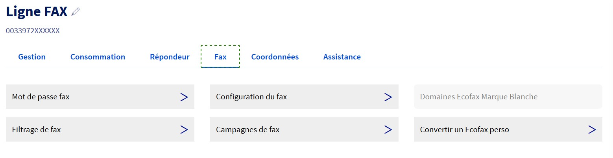
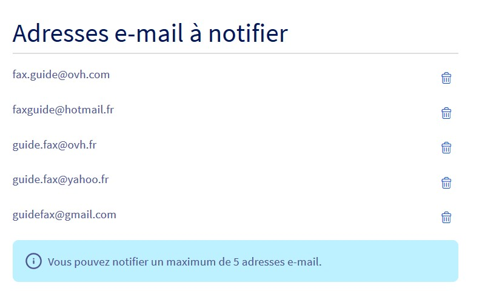

**Dernière mise à jour le 11/01/2021**

## Objectif

Vous pouvez configurer votre ligne fax directement via votre espace client OVHcloud. Ce guide indique comment configurer votre ligne Fax.

## Prérequis

- Disposer d’une ligne Fax OVHcloud.
- Être connecté à votre [espace client OVHcloud](https://www.ovh.com/auth/?action=gotomanager)

## En pratique

Connectez-vous à votre [espace client OVHcloud](https://www.ovh.com/auth/?action=gotomanager) puis sélectionnez `Télécom`{.action}. Cliquez ensuite sur `Téléphonie`{.action} puis sur le groupe ou se trouve votre ligne Fax.

## 
Afin de mettre en place la configuration de base de votre offre, cliquez sur Fax, puis sur Configuration du Fax dans la navigation après avoir préalablement sélectionné votre ligne.

{.thumbnail}

## Options générales
La qualité par défaut de vos télécopies peut avoir un impact sur la réception de certains numéros spéciaux. 
Passez la en Meilleure pour des envois vers les numéros spéciaux ou étrangers. 

Vous pouvez personnaliser l'ID des fax émis et des fax reçus.

Vous pouvez paramétrer le nombre de tentatives d'envoi maximum, dans le cas d'un échec de transmission lors de la première tentative.

{.thumbnail}

## Entête des fax émis
Vous avez la possibilité de personnaliser l'entête de vos fax selon la méthode ci-dessous.

{.thumbnail}

## Options de notifications
Personnalisez l'adresse e-mail et le nom de l'expéditeur des notifications que vous recevez, permettant entre autres d'éviter les filtres automatiques (type spam webmail).
Vous pouvez également définir le format Texte ou HTML de l'e-mail reçu.

{.thumbnail}

## Adresses à notifier
Configurez l'adresse e-mail sur laquelle vous recevrez les télécopies.
Vous pouvez renseigner jusqu'à 5 adresses différentes.

{.thumbnail}

## Aller plus loin

Échangez avec notre communauté d'utilisateurs sur <https://community.ovh.com>

