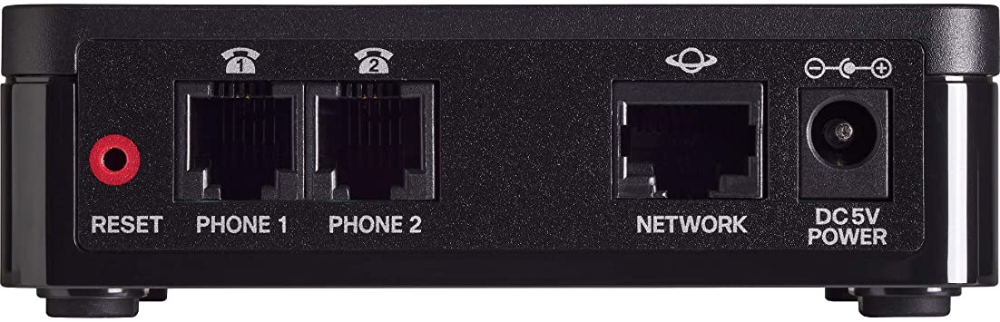
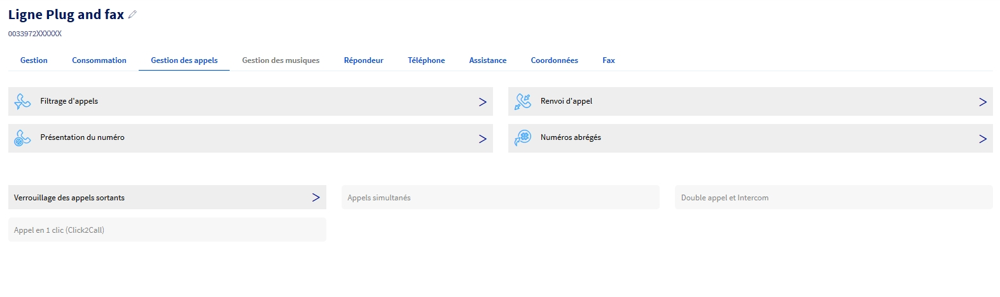
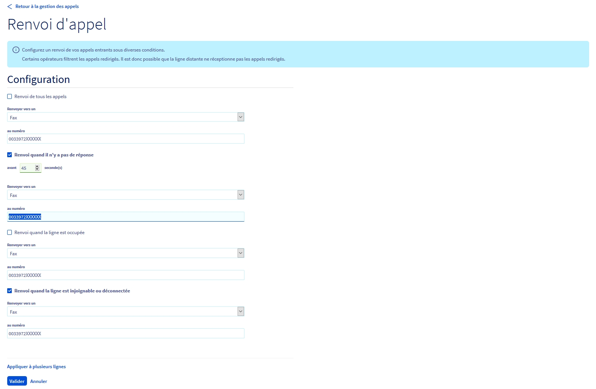
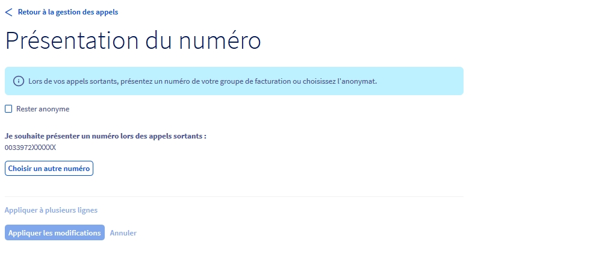

---
title: Utiliser son fax physique avec l’offre Plug And Fax
slug: utiliser-son-fax-physique-avec-l-offre-plug-and-fax
excerpt: Découvrez comment utiliser son fax physique avec l’offre Plug And Fax depuis votre espace client OVHcloud
section: Divers
legacy_guide_number: g2221
---

**Dernière mise à jour le 18/02/2021**

## Objectif

Vous pouvez configurer la reception de vos fax via votre espace client OVHcloud et ajuster la configuration du télécopieur utilisé. Ce guide vous permet de comprendre le fonctionnement de l'offre Plug And Fax et d'ajuster la configuration du télécopieur utilisé pour obtenir le meilleur rendu.

## Prérequis

- Disposer d’une ligne Plug And Fax OVHcloud.
- Être connecté à votre [espace client OVHcloud](https://www.ovh.com/auth/?action=gotomanager)

## En pratique

Connectez-vous à votre [espace client OVHcloud](https://www.ovh.com/auth/?action=gotomanager) puis sélectionnez `Télécom`{.action}. Cliquez ensuite sur `Téléphonie`{.action} puis sur le groupe ou se trouve votre ligne Plug And Fax.

------------------------------------------------------------------------

### Branchement du fax sur le Cisco ATA 191 {#branchement-du-fax-sur-le-CiscoATA191}

Le télécopieur utilisé se branche sur la prise RJ11 "**Phone 1**" de votre adaptateur. L'adaptateur doit également être branché en **Ethernet** sur votre routeur.

 {.thumbnail}

------------------------------------------------------------------------

### Configurer son Fax {#configurer-son-fax}

Dans le cadre de l'utilisation de votre fax physique avec l'offre Plug And Fax, il faut adapter la configuration de ce fax :

-   **La vitesse de transmission :** 9600 bauds maximum.
-   **Décroché automatique :** À activer au bout de 2 ou 3 sonneries maximum.
-   **La correction d'erreur :** À désactiver.

Sur certains fax, la correction d'erreur peut être appelée **ECM** ou **EMC**.

------------------------------------------------------------------------

### Configurer le mode de réception des fax {#configurer-le-mode-de-réception-des-fax}

L'offre**Plug And Fax** permet d'utiliser deux modes de **réception** :

-   Uniquement sur **le télécopieur** (En **secours**, réception par e-mail ou via Ecofax). Pour utiliser ce mode :

    -   Connectez-vous à votre Espace Client OVH : <https://www.ovhtelecom.fr/espaceclient/>
    -   Cliquez sur l'onglet "**Télécom**".
    -   Cliquez sur l'icône "**Téléphonie**" puis sur le groupe de la ligne Plug and Fax.
    -   Cliquez sur la ligne "**Plug and Fax**" à configurer.
    -   Cliquez sur "**Gestion des appels**".
    -   Cliquez sur "**Renvoi d'appel**".

{.thumbnail}

-   -   Cochez la case devant "**Si pas de réponse avant \_\_ sec:**".
        -   Définissez le nombre de secondes à 45. (Si votre fax est débranché, éteint ou en panne, vous recevrez toujours vos fax par mail ou via le logiciel Ecofax si le télécopieur n'a pas décroché après 45 secondes.)
        -   Choisissez le type de redirection vers **fax** et sélectionnez le numéro de votre ligne de **fax**.
    -   Cochez la case devant "**Si la ligne n'est pas disponible :**".
        -   Choisissez le type de redirection vers **fax** et sélectionnez le numéro de votre ligne de **fax**. Cette fonction permet de recevoir vos fax par mail ou le logiciel Ecofax en cas de non-réponse de la ligne.

    {.thumbnail}

-   Uniquement par e-mail ou via **Ecofax :**
    -   Connectez-vous à votre Espace Client OVH : <https://www.ovhtelecom.fr/espaceclient/>
    -   Cliquez sur l'onglet "**Télécom**".
    -   Cliquez sur l'icône "**Téléphonie**" puis sur le groupe de la ligne Plug and Fax.
    -   Cliquez sur la ligne "**Plug and Fax**" à configurer.
    -   Cliquez sur "**Gestion des appels**".
    -   Cliquez sur "**Renvoi d'appel**".
    -   Cochez la case "**Renvoyer tous les appels vers**"
    -   Sélectionnez "**Fax**" et sélectionnez le numéro de la ligne **Plug And Fax**. Dans cette configuration, tous les fax reçus seront disponibles uniquement par e-mail ou via le logiciel Ecofax.

    {.thumbnail}

Pour configurer les notifications par e-mail de votre ligne, reportez vous au guide [Configurer ma ligne Ecofax Pro]({originalUrl}/display/CRFAX/Configurer+ma+ligne+Ecofax+Pro).

------------------------------------------------------------------------

### Configurer la présentation du numéro en appel sortant {#configurer-la-présentation-du-numéro-en-appel-sortant}

Avec l'offre Plug And Fax, vous pouvez choisir la présentation du numéro en appel sortant. Pour configurer l'option :

-   Connectez-vous à votre Espace Client OVH : <https://www.ovhtelecom.fr/espaceclient/>
    -   Cliquez sur l'onglet "**Télécom**".
    -   Cliquez sur l'icône "**Téléphonie**" puis sur le groupe de la ligne Plug and Fax.
-   Cliquez sur la ligne "**Plug and Fax**" à configurer.
-   Cliquez sur "**Gestion des appels**".
-   Cliquez sur "**Présentation du numéro**"
-   Cliquez sur le bouton "**Choisir un autre numéro**".
    -   Choisissez le **numéro à présenter** parmi la liste.
    -   Pour ne pas présenter de numéro, **cochez**la case "**Rester anonyme**".
-   Confirmez la configuration en appuyant sur le bouton **Appliquer les modifications**. {.thumbnail}
